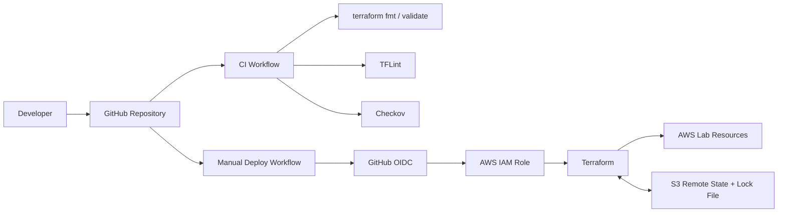

# Terraform AWS CI/CD Lab

A standalone personal lab that demonstrates a secure, reviewable Terraform delivery workflow for AWS using **GitHub Actions**, **OpenID Connect (OIDC)**, remote state, linting, static security checks, and controlled deployment.

> **Portfolio note:** This repository is an independent personal project. The architecture, names, code, and configuration are created specifically for this lab and are not copied from an employer or client environment.

## What this project demonstrates

- Terraform-based AWS infrastructure provisioning
- Remote Terraform state in Amazon S3 with versioning and native state locking
- GitHub Actions CI for formatting, validation, linting, and security scanning
- Short-lived AWS authentication from GitHub Actions through OIDC
- A controlled plan/apply workflow
- A separately guarded destroy workflow
- Secure-by-default AWS networking and S3 configuration
- Documentation of architecture, security decisions, deployment, and troubleshooting

## Architecture



The AWS lab stack creates a small multi-AZ VPC layout and a secured S3 data bucket. It deliberately avoids NAT Gateways, EC2 instances, load balancers, and other continuously billable resources.

## Repository layout

```text
.
├── .github/
│   └── workflows/
│       ├── terraform-ci.yml
│       ├── terraform-deploy.yml
│       └── terraform-destroy.yml
├── backend-bootstrap/
├── infrastructure/
├── docs/
├── .gitignore
├── .tflint.hcl
├── LICENSE
└── README.md
```

## CI/CD design

### Pull requests and pushes

The CI workflow runs without AWS credentials and checks:

1. `terraform fmt`
2. `terraform init -backend=false`
3. `terraform validate`
4. TFLint
5. Checkov

This keeps normal code validation separate from AWS deployment permissions.

### Deployment

Deployment is intentionally manual. The deploy workflow authenticates through GitHub OIDC, creates a saved plan, stores it as a short-lived artifact, and applies that exact plan only when **Apply changes** is explicitly enabled.

### Destruction

Destruction is a separate manual workflow and requires the operator to type `DESTROY`.

## Deployment validation

The complete delivery path has been tested successfully in a real AWS lab account.

| Validation | Result |
| --- | --- |
| Terraform format and validation | ✅ Passed |
| TFLint | ✅ Passed |
| Checkov security scan | ✅ Passed |
| GitHub OIDC → AWS role assumption | ✅ Passed |
| S3 remote state initialization | ✅ Passed |
| Plan-only workflow | ✅ Passed |
| Saved-plan deployment | ✅ Passed |
| Multi-AZ VPC and S3 lab deployment | ✅ Passed |
| Follow-up idempotency plan | ✅ **No changes** |

A real partial-apply scenario was also exercised during testing. A deliberately narrow IAM policy initially lacked an S3 read permission required by the Terraform AWS provider. Terraform preserved the successfully created resources in remote state, the permission was corrected, and a fresh plan reconciled the remaining work without rebuilding the network stack.

See [Deployment validation](docs/validation.md) for the full test record.

## GitHub configuration required

| Type | Name | Example |
| --- | --- | --- |
| Variable | `AWS_REGION` | `eu-west-2` |
| Variable | `TF_STATE_BUCKET` | `eranda-tf-state-unique-suffix` |
| Variable | `DEMO_BUCKET_NAME` | `eranda-cicd-lab-unique-suffix` |
| Secret | `AWS_ROLE_ARN` | `arn:aws:iam::<account-id>:role/github-terraform-lab` |

See [AWS OIDC setup](docs/aws-oidc-setup.md) and [Deployment](docs/deployment.md).

## Security choices

- No static AWS access keys are stored in GitHub.
- GitHub Actions uses OIDC for short-lived AWS credentials.
- Terraform state uses an encrypted, versioned, private S3 bucket with native lock files.
- The VPC default security group is emptied.
- The demo S3 bucket uses encryption, versioning, public access blocking, and lifecycle cleanup.
- Deployment and destruction are never triggered automatically from pull requests.
- Checkov exceptions are documented where production controls are intentionally omitted to keep the lab small and inexpensive.

See [docs/security.md](docs/security.md).

## Cost profile

This lab avoids NAT Gateways, EC2 instances, load balancers, and other continuously billed compute/network services. S3 charges depend on the small amount of state/data stored and requests made.

Always review current AWS pricing before deployment.

## Quick start

```bash
git clone git@github.com:reranda/terraform-aws-cicd-lab.git
cd terraform-aws-cicd-lab
```

Then follow [docs/deployment.md](docs/deployment.md).

## Status

**Foundation validated:** CI, OIDC authentication, remote state, plan, apply, and idempotency testing have all completed successfully.

The remaining lifecycle test is the guarded destroy workflow followed by a clean redeployment.
