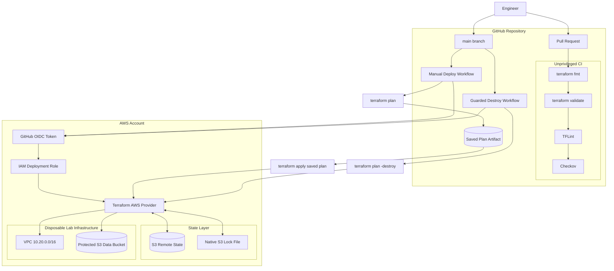
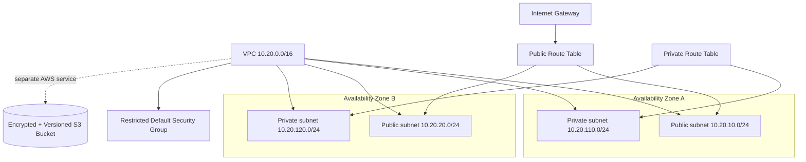

# Architecture

## Design goals

This lab is designed to demonstrate more than Terraform syntax. The architecture focuses on five engineering concerns:

1. **Separate validation from privileged deployment.**
2. **Avoid long-lived cloud credentials in CI/CD.**
3. **Keep Terraform state durable and independently managed.**
4. **Make deployment and destruction explicit, reviewable actions.**
5. **Keep the AWS footprint inexpensive enough for repeatable lab testing.**

## Delivery architecture



### Trust boundary

Normal CI never receives AWS credentials.

Only explicitly invoked deployment/destruction jobs request an OIDC token. AWS validates that token against the IAM role trust policy and returns temporary STS credentials.

This means there are no permanent AWS access keys stored as GitHub secrets.

## AWS infrastructure architecture



## Networking decisions

The VPC spans two explicitly configured Availability Zones.

Using explicit Availability Zones keeps the topology deterministic if AWS later adds another zone to the region.

### Public subnets

The two public subnets have a default route through the Internet Gateway.

They do **not** automatically assign public IPv4 addresses to launched resources.

### Private subnets

The two private subnets have no Internet default route.

No NAT Gateway is created. This keeps the lab inexpensive and makes the private route-table behavior clear. A production workload requiring outbound Internet access would need an additional egress design.

### Default security group

The VPC default security group is managed with no ingress or egress rules.

Workload-specific security groups should be created explicitly rather than relying on permissive defaults.

## S3 data bucket

The demonstration bucket enables:

- S3 Block Public Access
- object versioning
- server-side encryption with SSE-S3
- non-current version cleanup
- incomplete multipart-upload cleanup

Cross-region replication, a customer-managed KMS key, access logging, and event notifications are intentionally excluded from this small lab. Those decisions are documented rather than hidden behind broad security-scan exclusions.

## Terraform state architecture

The backend is created separately under `backend-bootstrap/`.

That separation means destroying the disposable lab does not destroy the state system used to manage it.

The backend enables:

- versioning
- server-side encryption
- S3 Block Public Access
- native Terraform S3 lock files through `use_lockfile = true`
- incomplete multipart-upload cleanup
- `prevent_destroy = true`

## Deployment lifecycle

```text
Code change
   ↓
CI validation
   ↓
Merge to main
   ↓
Manual plan
   ↓
Saved plan artifact
   ↓
Explicit apply
   ↓
Zero-change verification
   ↓
Guarded destroy (when required)
   ↓
Clean redeploy
```

This lifecycle was exercised end to end during project validation. See [validation.md](validation.md).
