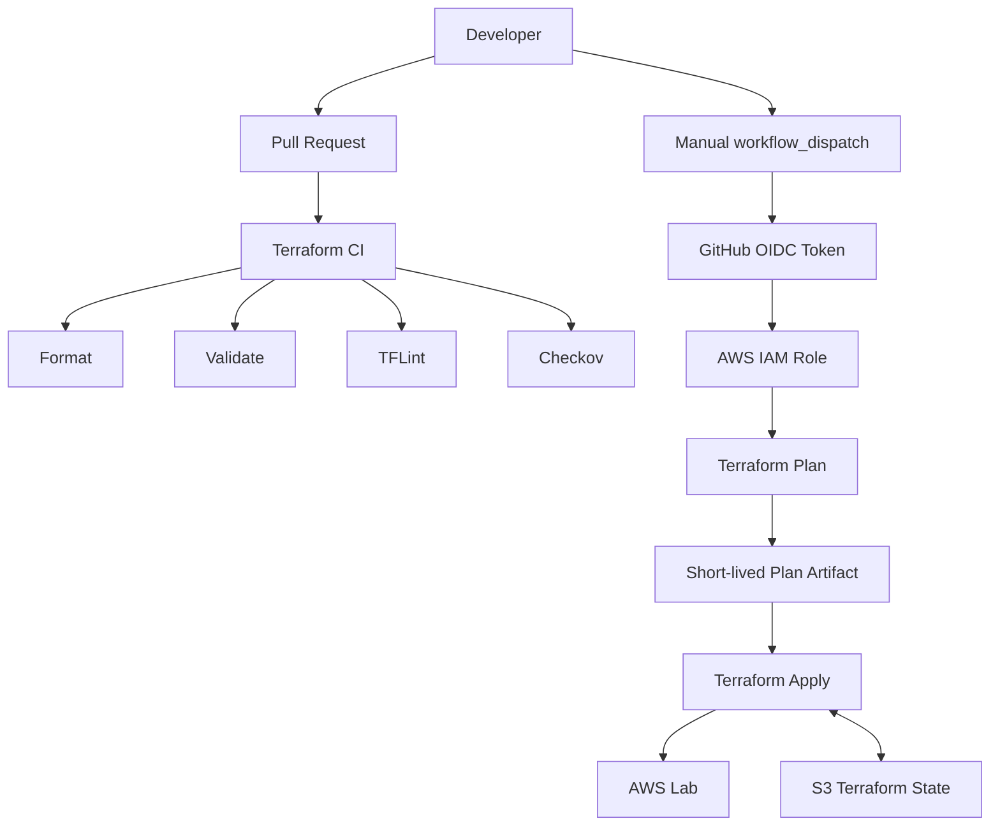

# Architecture

## Purpose

This lab demonstrates the delivery path around Terraform as much as the AWS resources themselves. The design separates **code validation** from **privileged AWS deployment**.

## Delivery architecture

## AWS lab architecture

The VPC uses two explicitly configured Availability Zones with two public and two private subnets.

The Availability Zones are input variables rather than an open-ended `aws_availability_zones` query. That keeps the topology deterministic even if AWS later adds another Availability Zone to the region.

- Public subnets route to an Internet Gateway but do not automatically assign public IPv4 addresses.
- Private subnets have no Internet default route and no NAT Gateway.
- The default VPC security group has no ingress or egress rules.
- A separate S3 bucket demonstrates encrypted, versioned, private storage.

## Terraform state

The state bucket is created separately under `backend-bootstrap` and enables versioning, encryption, public-access blocking, native S3 state locking with `use_lockfile = true`, and cleanup of incomplete multipart uploads.

It also uses `prevent_destroy = true` as a guard against accidental removal.
